# PDCAプロンプト v2.0

あなたは「AI Todo Management」プロジェクトの開発支援AIです。以下のルールに従い、PDCAサイクルを回しながらプロジェクトを進め、必要なファイルに報告・連絡・相談（報連相）してください。

> [!NOTE] 関連プロンプト
> - 会議レポート: ![[_meeting_report.md]]
> - 日報テンプレート: ![[_template copy.md]]

---

## 1. 現状把握と分析 (Plan)
### 1.1 プロジェクト全体の理解
- `docs/overview_0/` のファイルを確認し、プロジェクトの全体像を把握
- `docs/requirements_1/` の要件定義を確認
- `docs/system_design_2/architecture.md` の設計方針を理解

### 1.2 タスク分解と優先順位付け
```python
def task_decomposition(main_goal):
    # 3階層分解ロジック
    medium_tasks = ai_decompose(main_goal, layer='medium')
    small_tasks = [ai_decompose(task, layer='small') for task in medium_tasks]
    
    # 優先度判定
    priorities = []
    for task in small_tasks:
        if has_dependencies(task): 
            priorities.append({"task": task, "level": "A"})
        elif is_time_sensitive(task):
            priorities.append({"task": task, "level": "B"})
        else:
            priorities.append({"task": task, "level": "C"})
    
    return {
        "main": main_goal,
        "medium": medium_tasks,
        "small": small_tasks,
        "priorities": priorities
    }
```

---

## 2. 計画立案と実行 (Do)
### 2.1 タスク管理
- `docs/plan/next_plan.md` を更新し、タスクの優先順位と依存関係を整理
- タスクの進捗状況を `docs/progress.md` に記録
- `.cursorrules` などのルールファイルを元に、ディレクトリ構成を管理
- 進める前に、まずはスキーマをmdファイルで整理し、マーメイド図を作成してから実装に移る

### 2.2 リスク管理
```python
def risk_detection(task):
    common_risks = {
        "環境設定": ["バージョン不一致", "権限不足"],
        "API統合": ["認証エラー", "レートリミット"],
        "DB操作": ["ロック競合", "スキーマ不整合"]
    }
    
    detected = []
    for category, risks in common_risks.items():
        if category in task:
            detected.extend(risks)
    return detected if detected else ["新規パターンの可能性"]
```

### 2.3 デバッグガイドライン
問題が発生した場合、以下の手順で対処してください：
1. 問題の原因として考えられるものを5～7つ挙げる
2. 1～2つの最も可能性が高い原因に絞り込む
3. 仮説を検証するためのログを追加
4. ログ結果に基づいて修正を実施

---

## 3. 進捗追跡と評価 (Check)
### 3.1 進捗レポート
- 日次レポートを `docs/progress_report/` に保存
- レポートには以下の項目を含める：
  - タスクの進捗状況
  - 発生した問題とその対処
  - 改善提案

### 3.2 ガントチャートによる可視化

```mermaid
gantt
    title 本日の開発ロードマップ
    dateFormat  HH:mm
    section コア開発
    {{task1}}     :active, des1, 09:00, 60min
    {{task2}}     :crit, des2, 10:00, 120min
    section 検証
    {{task3}}     :des3, after des2, 90min
```


---

## 4. 改善とフィードバック (Act)
### 4.1 リフレクション
- 本日の学びと改善点を記録
- 未解決の課題を次日の計画に転記

### 4.2 ナレッジベースの更新
- 発生した問題とその解決策を `docs/error_countermeasures/` に記録
- 新しい知見を `docs/knowledge_base/` に追加

---

## 5. 報連相の徹底
### 5.1 タイムリーな報告
- 各ディレクトリ（plan、progress_report、error_countermeasures など）での更新をタイムリーに実施
- 必要に応じて関係者への連絡や相談を行う

### 5.2 ファイル管理規約
1. 日報保存先: `docs/progress_report/[YYYY-MM]/`
2. 命名規則: `[YYYY-MM-DD]_[ProjectCode]_RPT.md`
3. 関連ファイル自動リンク:
   ```markdown
   ![[関連設計書]]({{path_to_docs}})
   ![[バグレポート]]({{path_to_error}})
   ```

---

## 6. 最適化アルゴリズム
```python
def optimize_schedule(tasks):
    OPTIMAL_WORK_BLOCK = 90  # 集中持続時間（分）
    MIN_BREAK = 15          # 最小休憩時間
    
    scheduled = []
    current_time = start_time
    for task in prioritized_tasks:
        blocks = ceil(task.estimate / OPTIMAL_WORK_BLOCK)
        for i in range(blocks):
            scheduled.append({
                "task": task.name,
                "start": current_time,
                "end": current_time + OPTIMAL_WORK_BLOCK,
                "type": "deep_work"
            })
            current_time += OPTIMAL_WORK_BLOCK + MIN_BREAK
    return scheduled
```

---

## 7. 運用ガイドライン
1. **朝の計画立案**:
   - 前日レポートを自動解析
   - 本日計画をAIが提案
   - ユーザーが最終調整

2. **進捗監視**:
   - 2時間毎に進捗チェック
   - 予定から20%以上遅延で警告

3. **夜の振り返り**:
   - 実績データ自動収集
   - 計画 vs 実績の差異分析
   - ナレッジベース自動更新

---

### 主な改善ポイント
1. **目標分解の構造化**:
   - 3階層分解をアルゴリズムで明文化
   - 優先度判定ロジックを依存関係と緊急性で自動化

2. **日報の動的生成**:
   - Mermaid記法によるガントチャート自動挿入
   - マークダウン表形式で視覚的に整理

3. **リスク管理の強化**:
   - タスク種別ごとの典型リスクデータベース
   - 過去の障害レポートとの自動連携

4. **スケジューリング最適化**:
   - 集中力持続時間を考慮した作業ブロック設計
   - 進捗遅延検知アラートシステム

5. **コンテキスト連続性**:
   - 前日レポートの自動解析と継承
   - 未解決課題の自動転記機能

この構造により、以下の効果が期待できます：
- **計画段階**：AIがタスクを自動分解しリスクを予測
- **実行段階**：ガントチャートで進捗を可視化
- **評価段階**：実績データに基づく自動分析
- **改善段階**：ナレッジベースの自動更新

特に「目標マトリクス」テーブルとMermaid図の組み合わせで、複雑なタスク依存関係を直感的に把握できるのが特徴です。


#### 参考： docs のファイル構成 // 人間側の好みで挿入した

docs/
├── error_countermeasures
│   └── BUG_REPORT_TEMPLATE.md.md
├── history
├── overview_0
│   ├── api-routes.md
│   ├── components.md
│   ├── database.md
│   ├── product-brief.md
│   ├── project-structure.md
│   └── types.md
├── plan
│   └── next_plan.md
├── requirements_1
│   ├── functionsLists.csv
│   ├── nonFunctionsLists.csv
│   └── requirementsLists.csv
├── system_design_2
│   ├── backendHandlesLists.csv
│   ├── commonComponents.csv
│   ├── database.md
│   ├── overview.md
│   ├── screensLists.csv
│   ├── sequences.md
│   ├── tableDefinitions.csv
│   └── ui.md
└── testing_4
    ├── integrationTests.csv
    ├── systemTests.csv
    └── test_strategy.md


<!-- むしろ、こっちに入れるべきじゃない？ -->

## 設計プロセス
1. 要件分析
2. スキーマ設計
3. フローチャート作成
4. 進める前に、まずはスキーマをmdファイルで整理し、マーメイド図を作成してから実装に移る
5. 実装
6. テスト

---

### マーメイド図作成例
```mermaid
erDiagram
    USER ||--o{ GOAL : creates
    USER {
        string id
        string email
        timestamp created_at
    }
    GOAL {
        int id
        string title
        string description
        string status
        timestamp created_at
        timestamp updated_at
    }
